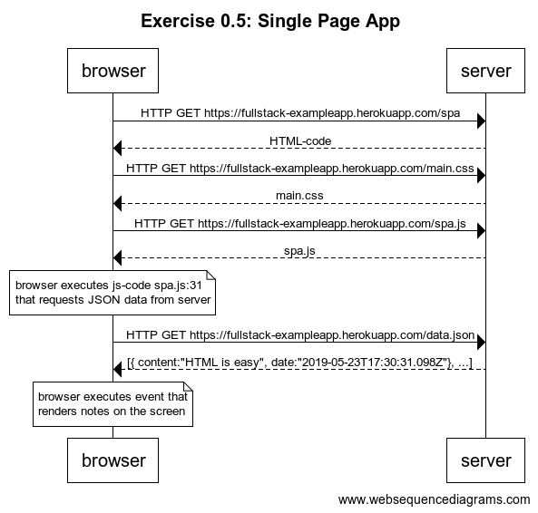
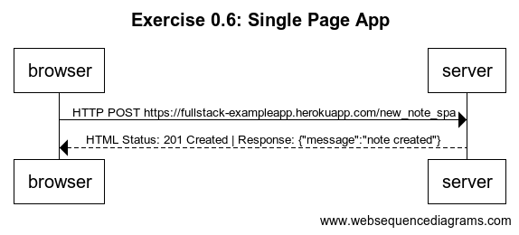

## 📝Exercise 0.4: New Note:
👉Create a diagram depicting the situation where the user creates a new note on page https://fullstack-exampleapp.herokuapp.com/notes by writing something into the text field and clicking the submit button.

👉If necessary, show operations on the browser or on the server as comments on the diagram.

👉The diagram does not have to be a sequence diagram. Any sensible way of presenting the events is fine.

* __Solution⤵__

## 📝Exercise 0.5: SPA:
👉Create a diagram depicting the situation where the user goes to the single page app version of the notes app at https://fullstack-exampleapp.herokuapp.com/spa.

* __Solution⤵__

## 📝Exercise 0.6: New Note SPA:
👉Create a diagram depicting the situation where user creates a new note using the single page version of the app.

* __Solution⤵__

